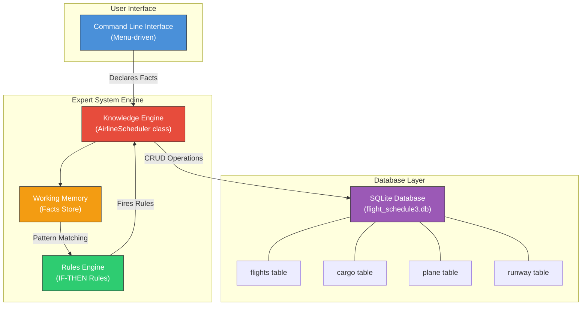
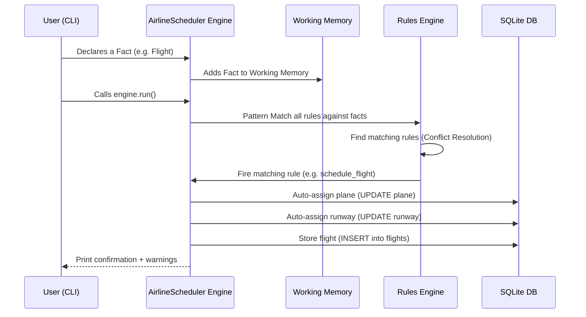
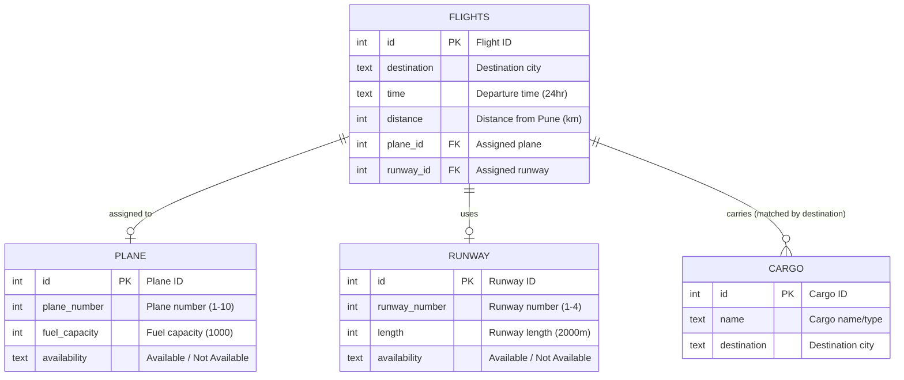
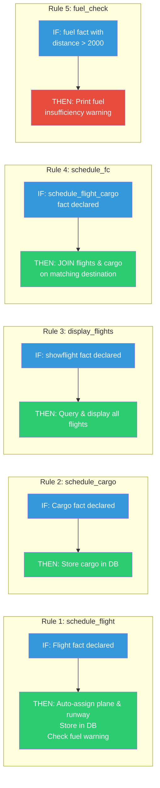
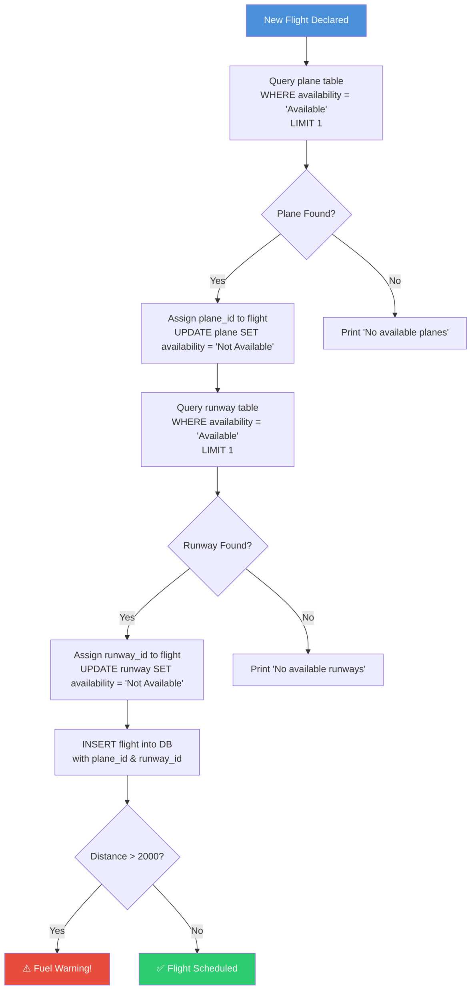
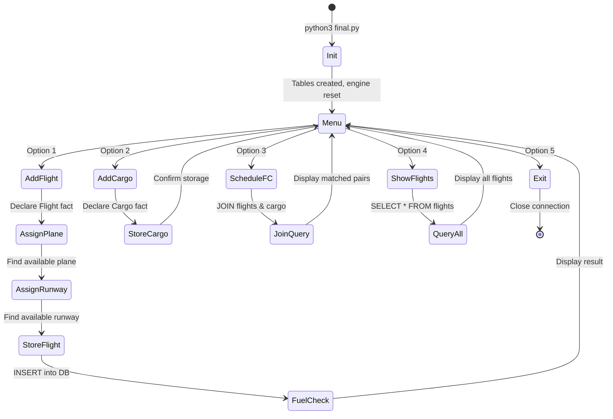

# 🛫 Airline & Cargo Scheduling Expert System

## Complete Project Guide

---

## 1. Project Overview

**Airline & Cargo Scheduling Expert System** is a **rule-based expert system** for automating airline flight scheduling and cargo allocation at **Pune International Airport**. It uses **Artificial Intelligence (forward-chaining inference)** to automatically:

- Schedule flights with auto-assigned planes and runways
- Allocate cargo to matching flights based on destination
- Check fuel sufficiency for long-distance flights
- Manage airport resource availability (planes, runways)

> [!IMPORTANT]
> This is an **Expert System** — a branch of AI that mimics human decision-making using a set of **IF-THEN rules**. Unlike machine learning, expert systems use explicitly programmed knowledge rules to make decisions.

---

## 2. Technology Stack

| Technology | Purpose |
|------------|---------|
| **Python 3** | Core programming language |
| **Experta** | Expert system / rules engine library (Python port of CLIPS) |
| **SQLite3** | Lightweight embedded database for persistent storage |
| **Forward Chaining** | AI inference strategy — rules fire when facts match conditions |

---

## 3. System Architecture

### 3.1 High-Level Architecture



### 3.2 How the Expert System Works (Inference Cycle)



---

## 4. Database Schema

The system uses **SQLite** with 4 tables, all created fresh on each run:

### 4.1 Entity Relationship Diagram



### 4.2 Table Details

| Table | Records on Init | Key Fields | Purpose |
|-------|-----------------|------------|---------|
| `plane` | 10 planes (all "Available") | plane_number, fuel_capacity (1000), availability | Pool of assignable aircraft |
| `runway` | 4 runways (all "Available") | runway_number, length (2000m), availability | Pool of assignable runways |
| `flights` | Empty | destination, time, distance, plane_id, runway_id | Scheduled flights |
| `cargo` | Empty | name, destination | Registered cargo shipments |

> [!NOTE]
> Tables are **dropped and recreated** every time the application starts. This ensures a clean slate for each session. Data does not persist across runs.

---

## 5. Expert System Rules Engine

The heart of the system is its **rules engine** built with the `experta` library. Here's how each rule works:

### 5.1 Fact Classes (Knowledge Representation)

Facts are the **data objects** that the engine reasons about:

```python
class Flight(Fact)       # Represents a flight (id, destination, time, distance)
class Cargo(Fact)        # Represents cargo (id, name, destination)
class plane(Fact)        # Represents a plane resource
class runway(Fact)       # Represents a runway resource
class showflight(Fact)   # Trigger to display all flights
class schedule_flight_cargo(Fact)  # Trigger to match flights with cargo
class fuel(Fact)         # Trigger for fuel check
```

### 5.2 Rules (IF-THEN Logic)



### 5.3 Rule Details

| # | Rule | Trigger | Action | Smart Behavior |
|---|------|---------|--------|----------------|
| 1 | `schedule_flight` | `Flight` fact declared | Finds next available plane & runway, stores flight in DB | Auto-assigns resources, marks them "Not Available" |
| 2 | `schedule_cargo` | `Cargo` fact declared | Stores cargo info in DB | Simple storage |
| 3 | `display_flights` | `showflight` fact declared | Queries all flights from DB | Displays with plane & runway IDs |
| 4 | `schedule_fc` | `schedule_flight_cargo` fact declared | SQL JOIN on `flights.destination = cargo.destination` | **Intelligent cargo-flight matching** |
| 5 | `fuel_check` | `fuel` fact with distance | Checks if distance > 2000 | **Warns if fuel insufficient** for the distance |

### 5.4 Resource Assignment Algorithm



---

## 6. File Structure & Breakdown

```
airline-scheduling-expert-system/
├── final.py              ← 🚀 Main entry point (run this!)
├── home.py               ← Earlier version (has git merge conflicts)
├── b.py                  ← Prototype / basic skeleton
├── database.py           ← Standalone DB schema setup script
├── flight_schedule3.db   ← SQLite database (auto-created by final.py)
├── flight_schedule2.db   ← Older database files
├── flight_schedule.db    ← Older database files
├── database.db           ← Used by database.py
└── README.md             ← Project readme
```

### File Details

| File | Lines | Role |
|------|-------|------|
| [final.py](file:///Users/amardip/Desktop/airline%20/airline-scheduling-expert-system/final.py) | 303 | **Main application** — Contains the complete expert system with all rules, DB operations, and CLI menu |
| [home.py](file:///Users/amardip/Desktop/airline%20/airline-scheduling-expert-system/home.py) | 277 | Earlier version with unresolved git merge conflicts (lines 1 & 274-276). Not runnable as-is |
| [b.py](file:///Users/amardip/Desktop/airline%20/airline-scheduling-expert-system/b.py) | 35 | Basic prototype — simple rule definitions without DB integration |
| [database.py](file:///Users/amardip/Desktop/airline%20/airline-scheduling-expert-system/database.py) | 29 | Standalone script to create the initial DB schema (flights + cargo tables) |

---

## 7. Feature Walkthrough

### 7.1 Application Flow



### 7.2 Menu Options

| Option | What It Does | Example |
|--------|-------------|---------|
| **1. Add Flight** | Enter flight ID, destination, time (24hr), and distance from Pune. System auto-assigns a plane & runway | Flight 101 → Mumbai at 14:30, Plane 1, Runway 1 |
| **2. Add Cargo** | Enter cargo ID, name, and destination. Stored in DB for later matching | Cargo "Electronics" → Mumbai |
| **3. Schedule Flight + Cargo** | Matches cargo to flights with the **same destination** using SQL JOIN | Electronics → matched to Flight 101 (both Mumbai) |
| **4. Show Flights** | Displays all scheduled flights with their assigned planes & runways | Lists Flight 101 & 202 with details |
| **5. Exit** | Exits the application | — |

---

## 8. Key Concepts Explained

### 8.1 What is an Expert System?

An expert system is an AI program that simulates the **decision-making ability of a human expert**. It consists of:

| Component | In This System |
|-----------|-----------|
| **Knowledge Base** | Rules defined with `@Rule` decorators in the `AirlineScheduler` class |
| **Working Memory** | Facts declared via `engine.declare()` — flights, cargo, triggers |
| **Inference Engine** | Experta's forward chaining — when `engine.run()` is called, it matches facts against rules |
| **User Interface** | The CLI menu loop in `__main__` |

### 8.2 Forward Chaining (Data-Driven Reasoning)

```
User declares fact → Fact enters Working Memory → Engine scans all rules →
Rules whose conditions match fire → Actions execute → New facts may be added → Repeat
```

This is the opposite of **backward chaining** (goal-driven). This system uses forward chaining because:
- New flight/cargo data triggers scheduling decisions
- The system reacts to incoming data rather than working backward from a goal

### 8.3 The `experta` Library

`experta` is a Python implementation of the **CLIPS** expert system tool. Key concepts:

| Concept | Code | Purpose |
|---------|------|---------|
| `Fact` | `class Flight(Fact)` | A piece of knowledge/data |
| `Rule` | `@Rule(AS.f << Flight(...))` | An IF-THEN rule that fires when matching facts exist |
| `MATCH` | `destination=MATCH.destination` | Extracts values from matching facts |
| `AS` | `AS.f << Flight(...)` | Binds a matched fact to a variable for later use |
| `declare()` | `engine.declare(Flight(...))` | Adds a fact to working memory |
| `run()` | `engine.run()` | Triggers the inference cycle |
| `reset()` | `engine.reset()` | Clears working memory |

---

## 9. How to Run the Project

### 9.1 Prerequisites

- **Python 3.6+** installed on your system
- **pip** (Python package manager)

### 9.2 Step-by-Step

```bash
# Step 1: Clone the repository (if not already done)
git clone https://github.com/shubham-murtadak/airline-scheduling-expert-system.git
cd airline-scheduling-expert-system

# Step 2: Install the required dependency
pip3 install experta

# Step 3: Run the application
python3 final.py
```

### 9.4 Sample Test Run

```
# Add a flight:
Option 1 → ID: 101, Destination: Mumbai, Time: 1430, Distance: 150
→ Output: Flight 101 is scheduled from PUNE to Mumbai at 1430 with Plane 1 and Runway 1.

# Add another flight (long distance):
Option 1 → ID: 202, Destination: Delhi, Time: 1800, Distance: 2500
→ Output: Flight 202 is scheduled... with Plane 2 and Runway 2.
→ ⚠️ !!!insufficient fuel please add extra fuel to plane !!!

# Add cargo:
Option 2 → ID: 1, Name: Electronics, Destination: Mumbai
→ Output: kargo Electronics is store in database with destination Mumbai

# Match cargo to flights:
Option 3
→ Output: Flight ID: 101, Destination: Mumbai, Time: 1430, cargo id:1, cargo name:Electronics

# View all flights:
Option 4
→ Lists all flights with plane and runway assignments
```

### 9.5 Limitations to be Aware Of

> [!WARNING]
> - Database is **reset on every run** — all data is lost when you restart
> - Maximum **10 flights** before planes run out (10 planes available)
> - Maximum **4 simultaneous flights** before runways run out (4 runways)
> - `home.py` has **git merge conflicts** — use `final.py` instead
> - No GUI yet (marked as "coming soon" in the codebase)

---

## 10. Potential Improvements

| Area | Enhancement |
|------|-------------|
| **Persistence** | Remove `DROP TABLE` on startup to preserve data across sessions |
| **GUI** | Add a Tkinter or web-based interface (referenced in `gui.py`) |
| **More Rules** | Add weather-based delays, passenger priority, time conflict detection |
| **Fuel Logic** | Calculate required fuel based on distance instead of just warning |
| **Runway Reuse** | Free up runways after flights depart (time-based) |
| **Reporting** | Generate PDF/CSV reports of daily schedules |
